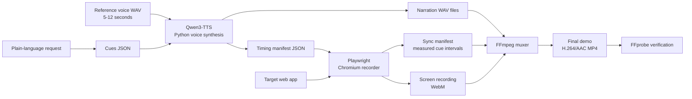

# auto-demo

Ask your coding agent for a product demo video. It writes the narration, drives a real browser through your app, and hands you a narrated 1080p MP4 with a synthetic cursor and a cloned voice.

The agent does the work. You describe the app.

## Use it

Install the skill once (see [Install](#install)), then open Claude Code in your app's repo and ask for a demo in plain language:

```text
make a 60 second narrated demo of the reporting dashboard
```

```text
record a walkthrough of the signup flow, three or four sentences
```

That's the whole interface. The agent inspects the running app, drafts the narration, finds the selectors, syncs the voice to each screen, and delivers `output/final_demo.mp4`.

**The one thing only you can provide** is a 5–12 second sample of your own voice, saved once as `assets/reference_voice.wav`. The agent cannot record that for you. Everything after that is the agent's problem.

## Install

Install the toolchain once, if you don't have it:

```bash
brew install python@3.12 node ffmpeg
```

On macOS, get 3.12 ahead of any other Python on your `PATH` before going further:

```bash
echo 'export PATH="/opt/homebrew/opt/python@3.12/bin:$PATH"' >> ~/.zshrc
source ~/.zshrc
```

Then install the skill:

```bash
mkdir -p ~/.claude/skills
git clone https://github.com/joshshiman/auto-demo.git ~/.claude/skills/record-demo
bash ~/.claude/skills/record-demo/scripts/setup_env.sh
(cd ~/.claude/skills/record-demo && npx playwright install chromium)
```

That creates a Python environment, installs the model dependencies, and downloads Chromium. It takes a few minutes and needs about **3 GB of disk** for the TTS model.

**Prerequisites:** Python 3.11 or 3.12 (not 3.13+, where the PyTorch wheels aren't published), Node.js 20+, and FFmpeg. On Apple Silicon the pipeline runs on MLX and is fast; elsewhere it uses PyTorch and falls back to CPU, which is slow.

To update an existing install:

```bash
(cd ~/.claude/skills/record-demo && git pull)
```

Restart Claude Code after updating so it reloads the skill.

## Voice sample

Record yourself speaking normally for 5–12 seconds — no music, no background noise — and save it as `assets/reference_voice.wav` in the skill directory. Convert it if you recorded something else:

```bash
ffmpeg -i ~/Desktop/my_voice.m4a -t 8 -ar 16000 -ac 1 ~/.claude/skills/record-demo/assets/reference_voice.wav
```

This file is ignored by Git. It is your voice, and it should not end up in a repo.

On Apple Silicon that's the last setup step. On Windows and Linux, also write down the **exact words** you said in the clip — the PyTorch backend needs them verbatim.

## What the agent does

The pipeline behind a single request. You can read this to know what the agent is up to, or to sanity-check a result.

| Step | What happens |
| --- | --- |
| 1. Draft cues | Reads the running app, picks the scenes worth showing, and writes one narration sentence per scene. |
| 2. Synthesize | Generates each sentence in your cloned voice. Happens *before* recording, so the recorder knows how long each clip runs. |
| 2b. Pace | Lengthens the pauses and slows the delivery slightly, so the narration doesn't sound rushed. |
| 3. Write the workflow | Copies the recorder template and fills in your app's real navigation and selectors, pairing every cue with the scene it should wait for. |
| 4. Record | Drives a real Chromium window, with a cursor that moves like a hand and click effects. It hovers over what each line is about while the line plays, and records when each cue actually started and ended. |
| 5. Sync | Lines the narration up with what was recorded, inserting silence over browser transitions so a sentence never starts over a loading screen. |
| 6. Mux and verify | Produces a 1920x1080 H.264/AAC MP4 and checks it is real. |

The round trip in steps 2 and 4 is what makes the sync work: audio is generated first, then the recording reports back when each line actually played.

## Driving it by hand

Rarely needed. If you want to run a single stage yourself, or you are debugging a bad result:

```bash
SKILL=~/.claude/skills/record-demo
APP=/path/to/your/app

# 1. your narration, one sentence per scene, in the app repo
mkdir -p "$APP/output" && echo '[
  { "id": "cue_01", "text": "Welcome to the reporting dashboard." },
  { "id": "cue_02", "text": "Here is the workflow you can automate." }
]' > "$APP/output/cues.json"

# 2. synthesize. The venv lives in the skill dir; the output goes to the app.
if [[ "$(uname -s)" == "Darwin" && "$(uname -m)" == "arm64" ]]; then
  PY="$SKILL/.venv-mlx/bin/python"
else
  PY="$SKILL/.venv/bin/python"
fi
cd "$APP"
"$PY" "$SKILL/scripts/voice_clone.py" \
  --cues output/cues.json \
  --ref-audio "$SKILL/assets/reference_voice.wav"

# 2b. pace it: longer pauses, slightly slower; keeps the raw clips in output/audio_raw
"$PY" "$SKILL/scripts/pace_audio.py"

# 3. record. Needs DEMO_URL and a customized output/run_demo.js.
DEMO_URL="http://localhost:3000" node output/run_demo.js

# 4. mux and verify
bash "$SKILL/scripts/mux.sh" output/audio output/recordings output/final_demo.mp4
ffprobe -v error -show_entries format=duration:stream=codec_name,width,height \
  -of default=noprint_wrappers=1 output/final_demo.mp4
```

The recorder must live at `output/run_demo.js` in the app repo and be run from that
repo's root — it resolves `output/` relative to itself.

## Environment variables

Set these in the target app's environment before asking for a demo. The agent handles them unless you need something unusual.

| Variable | Default | What it does |
| --- | --- | --- |
| `DEMO_URL` | — (required) | The app to record. |
| `DEMO_HEADLESS` | `0` | Set to `1` to hide the browser window. |
| `DEMO_VIEWPORT_WIDTH` | `2000` | Page width. Override for very wide layouts. |
| `DEMO_VIEWPORT_HEIGHT` | `1125` | Page height. |
| `DEMO_USER_DATA_DIR` | — | Persistent Chromium profile to record in. Sign in to the app once in that profile, and the recording reuses the session. |
| `DEMO_ACTIONS` | — | JSON clicks (`{selector, cue, waitForBefore, waitForAfter}`) if you'd rather not let the agent edit the template. |
| `SYNC_MANIFEST` | `output/sync_manifest.json` | Override the sync manifest path. |
| `PYTHON` | auto | Python used by `mux.sh`. It defaults to the first of `python3` and `python` that works. |

The page is recorded at 2000x1125 so wide layouts don't clip at the right edge, then scaled to 1920x1080 in the final file.

## How it fits together



## Troubleshooting

**A demo came out with narration over the wrong screens** — cue order didn't match the visual order. Ask the agent to re-check the pairing, or edit `output/run_demo.js` so each `runCue` waits on the scene it narrates.

**The final video is shorter than you expected** — the muxer caps the output at the narration length, and stops early if the recording runs out first. A small trailing cut is normal; a large one means a cue is missing. Compare:

```bash
ffprobe -v error -show_entries format=duration -of default=noprint_wrappers=1 output/audio/master_narration.wav
ffprobe -v error -show_entries format=duration -of default=noprint_wrappers=1 output/final_demo.mp4
```

**The narration sounds rushed** — run `scripts/pace_audio.py` (step 2b). For more room, use `--long-extra 0.6` or `--tempo 0.9`.

**`No working python3 or python found` on Windows** — `mux.sh` needs a Python on `PATH`. Set `PYTHON` to the skill venv's `python.exe`.

**`externally-managed-environment`** — something installed into system Python. Use `scripts/setup_env.sh`; it makes its own venv.

**Torch import errors, or `backcompat`** — the Python is too new. Install 3.12, delete the venv, and rerun `scripts/setup_env.sh`.

**Narration takes forever** — running on the CPU PyTorch path. On a Mac, make sure the agent is using the `.venv-mlx` environment, not `.venv`.

**Voice sounds wrong or the transcript is rejected** — the PyTorch backend needs the reference transcript to match the sample word for word. The MLX path ignores the transcript entirely and is more forgiving.

**`No recordings found`** — the recorder didn't finish, or the mux ran from the wrong directory. Check that `output/recordings/*.webm` exists.

**Model download fails** — check free disk space, clear an old `~/.cache/huggingface`, retry.

## Project layout

| Path | Purpose |
| --- | --- |
| `SKILL.md` | The skill definition the agent reads. The source of truth. |
| `.claude/skills/record-demo.md` | Entry point for when you work inside this repo. Points at `SKILL.md`. |
| `scripts/setup_env.sh` | Creates the Python environment and installs Node dependencies |
| `scripts/voice_clone.py` | Generates narration audio and timing manifests with Qwen3-TTS |
| `scripts/pace_audio.py` | Lengthens pauses and slows the narration, keeping the raw TTS clips |
| `scripts/run_demo_template.js` | Recorder template with a human-like cursor, click effects, and cue timing |
| `scripts/mux.sh` | Aligns narration with the recording and muxes the final MP4 |
| `output/` | Everything generated. Ignored by Git. |
| `assets/reference_voice.wav` | Your voice sample. Ignored by Git. |

## Development checks

```bash
npm ci
npm run lint
npm run typecheck
npm test
.venv/bin/python tests/test_pace_audio.py   # Windows: .venv/Scripts/python
```

The npm scripts validate the recorder template's syntax only. `test_pace_audio.py` checks the pause stretching. There is no end-to-end test target in the repo.

## Before you share this

- Keep `assets/*.wav` local. Never commit a personal voice reference.
- Keep `.env`, credentials, authenticated URLs, and target-specific secrets out of the repo.
- Keep `output/` ignored — it contains recordings, selectors, and application data.
- No license is included. Add one before distributing this outside your team.
